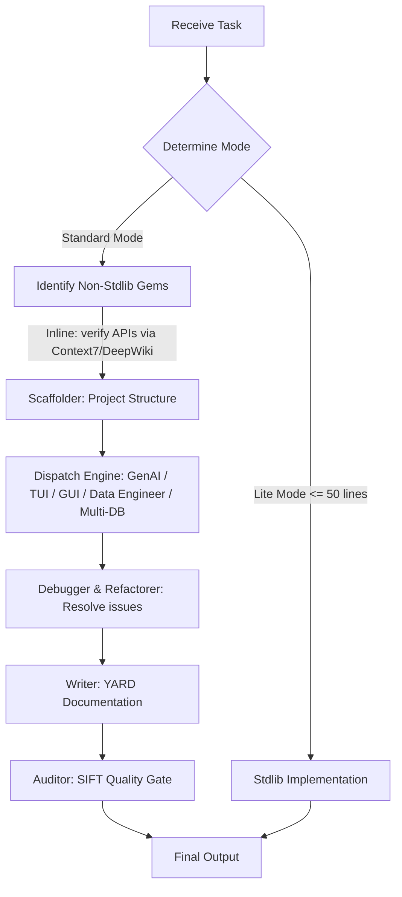

# The Ruby-Dev Metaskill

## Overview

The `ruby-dev` skill is a unified, task-driven orchestrator for Ruby development. It coordinates a team of 11 specialized virtual agents to execute scaffolding, data engineering, multi-database modeling, GenAI components, TUIs, desktop GUIs, diagnostic analysis, refactoring, documentation, and quality audits.

This skill operates under a **Task-Driven Agent Dispatch** model. It matches incoming developer requests to specialized virtual agents in the registry, executing tasks in a structured pipeline.

---

## Core Execution Mandates

1. **Functional-First Delivery**: Focus entirely on technical precision and functional correctness. Do not adopt a conversational persona.
2. **Inline Gem Verification**: When a task touches a non-stdlib gem, query Context7 MCP (or DeepWiki for the gem's GitHub repo) for the API signature at the point of use — in the consuming skill, not via a centralized gatekeeper. Do not assume gem APIs from memory.
3. **Type Safety & Error Handling**: For complex logic, enforce `dry-struct` typing and `dry-monads` (Success/Failure) patterns. Simple scripts may use Lite Mode (standard library only).
4. **Convention Locking**: All code must comply with RuboCop/StandardRB conventions, use `frozen_string_literal: true`, and maintain Zeitwerk-compliant directory mapping.
5. **Method Visibility & Naming Discipline**: Default new methods to `private`; only promote to `public` when the method is a deliberate, stable part of the object's interface (public methods are a backward-compatibility commitment — private ones can be changed or deleted freely). Scale method name length inversely with call frequency: short names (`size`, `[]`) for methods called constantly, descriptive names for rarely-called configuration or setup methods. When a method exists purely to delegate to another with the same arguments, forward everything with `...` (`def foo(...) = bar(...)`) rather than re-declaring the parameter list.

---

## Virtual Agent Registry

The orchestrator dispatches tasks to the following virtual agents based on trigger conditions:

### 1. The Project Scaffolder (`scaffolder`)
* **Trigger**: "start project", "create gem", "scaffold", "new ruby application"
* **Instructions**: [scaffold/SKILL.md](../scaffold/SKILL.md)
* **Role**: Configures project structure using `rubysmith`/`gemsmith` flag presets and runs the convention pass.

### 2. The Data Pipeline Engineer (`data_engineer`)
* **Trigger**: "parse CSV/JSON", "ETL pipeline", "batch process files", "Sequel bulk insert"
* **Instructions**: [data-engineer/SKILL.md](../data-engineer/SKILL.md)
* **Role**: Builds efficient, stream-based data transformations and database bulk operations.

### 3. The Data Modeler (`multi_db`)
* **Trigger**: "Ohm model", "Sequel model", "Redis model", "pgvector store", "multi-database", "dual-database", "ORM pattern"
* **Instructions**: [multi-db/SKILL.md](../multi-db/SKILL.md)
* **Role**: Designs Ohm/Sequel models, picks the right store per concern, and applies dual-database storage/retrieval patterns (payload separation, hybrid RRF, scalar filters).

### 4. The Cognitive Architect (`cognitive_architect`)
* **Trigger**: "RAG pipeline", "LLM agent", "pgvector integration", "dspy.rb", "MCP server"
* **Instructions**: [genai/SKILL.md](../genai/SKILL.md)
* **Role**: Scaffolds AI/NLP components prioritizing clause-level semantic processing and RRF hybrid retrieval.

### 5. The TUI Builder (`tui_builder`)
* **Trigger**: "build CLI UI", "terminal prompt", "terminal table", "terminal progress bar"
* **Instructions**: [tui/SKILL.md](../tui/SKILL.md)
* **Role**: Implements rich terminal interfaces using the 21 gems in the TTY toolkit.

### 6. The GUI Builder (`gui_builder`)
* **Trigger**: "desktop app", "GUI", "native window", "glimmer", "libui"
* **Instructions**: [gui/SKILL.md](../gui/SKILL.md)
* **Role**: Builds native cross-platform desktop interfaces with glimmer-dsl-libui, using data-bound MVP architecture.

### 7. The Stealth Debugger (`debugger`)
* **Trigger**: Zeitwerk errors, performance bottlenecks, dead code, "debug", "fix bug"
* **Instructions**: [analyse/SKILL.md](../analyse/SKILL.md)
* **Role**: Diagnoses code issues using Gemba Walk, Muda Analysis, Root-Cause Tracing, and Five Whys.

### 8. The Surgical Refactorer (`refactorer`)
* **Trigger**: Code smells detected, "refactor this method", "apply pattern"
* **Instructions**: [refactor/SKILL.md](../refactor/SKILL.md)
* **Role**: Applies named refactoring patterns from the pattern catalog to resolve specific code issues.

### 9. The Technical Writer (`writer`)
* **Trigger**: "add documentation", "write comments", "generate yardoc", "YARD"
* **Instructions**: [yardoc/SKILL.md](../yardoc/SKILL.md)
* **Role**: Analyzes code structure and generates precise YARD tags with type assertions and examples.

### 10. The Pragmatic Auditor (`auditor`)
* **Trigger**: Code reviews, PR audits, "is this production ready", "SIFT audit"
* **Instructions**: [sift/SKILL.md](../sift/SKILL.md)
* **Role**: Conducts SIFT audits (Structure, Idioms, Functionality, Testing) using Toulmin evidence.

### 11. The Optimizer (`optimizer`)
* **Trigger**: "slow", "optimize", "performance", "profile", "benchmark", GC/memory pressure
* **Instructions**: [perf/SKILL.md](../perf/SKILL.md)
* **Role**: Runs the Profile-Benchmark-Optimize cycle; keeps only measured wins (>= 10-20%), reverts the rest.

---

## Dispatch & Execution Workflow

Follow this step-by-step pipeline when executing any Ruby task:



### Step 1: Mode Selection & Entry Survey
Analyze the complexity and file footprint:
* **Lite Mode**: Scripts under 50 lines, standard library only, self-contained. Skip complex structures.
* **Standard Mode**: Multi-file, framework/gem dependent. Enforce the full pipeline.

### Step 2: Gem Verification & Dependency Check
For Standard Mode, extract all non-stdlib gems from Gemfile or description. The consuming skill (genai, tui, data-engineer, multi-db, etc.) is responsible for verifying each gem's API via Context7 MCP / DeepWiki at the point of code generation. No central registry or dispatch step.

### Step 3: Implement & Orchestrate
Dispatch to the domain-specific builder agents:
* For CLI applications and TUI creation: Dispatch to `scaffolder` then `tui_builder`.
* For desktop GUI applications: Dispatch to `scaffolder` then `gui_builder`.
* For ETL pipelines and large files: Dispatch to `data_engineer`.
* For AI agents, RAG, and MCP servers: Dispatch to `cognitive_architect`.
* For Ohm/Sequel model design, ORM picking/porting, or dual-database storage/retrieval: Dispatch to `multi_db`.

### Step 4: Refactor, Document & Audit (Sift Quality Gate)
1. **Debug & Refactor**: If errors arise or code smells are found, run `debugger` to pinpoint causes, then use `refactorer` to apply pattern-based fixes. For performance symptoms, `debugger` locates the suspect and hands off to `optimizer` for the Profile-Benchmark-Optimize cycle.
2. **Document**: Run `writer` to add precise YARD documentation.
3. **SIFT Quality Gate**: Finally, run `auditor` to audit the code across all 4 SIFT dimensions. Ensure the final Toulmin audit report is clean before delivery.

---

## Typing & Resilience Standards

When writing production-grade code (Standard Mode), enforce the following `dry-rb` patterns:

### 1. Data Representation via Dry::Struct
Do not use raw Hashes or untyped OpenStructs. Define data models explicitly:
```ruby
# frozen_string_literal: true

require "dry-struct"
require "dry-types"

module Types
  include Dry.Types()
end

module Model
  class User < Dry::Struct
    attribute :id, Types::Integer
    attribute :email, Types::String
    attribute :active, Types::Bool.default(true)
  end
end
```

### 2. Operation Pipelines via Dry::Monads
Use `Success` and `Failure` monads to handle control flow. Avoid bare rescues and nested conditions:
```ruby
# frozen_string_literal: true

require "dry/monads"

class ProcessPayment
  include Dry::Monads[:result]

  def call(amount:)
    return Failure(:invalid_amount) if amount <= 0

    result = charge_gateway(amount)
    if result.success?
      Success(result.transaction_id)
    else
      Failure(result.error_message)
    end
  rescue StandardError => e
    Failure("Gateway crash: #{e.message}")
  end
end
```

---

## Subagent Dispatch (Claude Plugin)

Each virtual agent in the registry is also available as a real subagent (defined in this plugin's `agents/` directory): `scaffolder`, `data-engineer`, `multi-db`, `cognitive-architect`, `tui-builder`, `gui-builder`, `debugger`, `refactorer`, `technical-writer`, `auditor`, and `optimizer`. When a pipeline stage benefits from isolated context - e.g., a SIFT audit that should judge the code without the builder's assumptions, or a long diagnostic pass - dispatch that stage to the corresponding subagent via the Task tool. For small tasks, run the stages inline by following the linked SKILL.md files directly; subagent dispatch is an option, not a requirement.

## Verification Checklist

Before completing the task, verify the following:

- [ ] All non-stdlib gem APIs verified inline via Context7/DeepWiki at the point of use
- [ ] `# frozen_string_literal: true` is on the first line of every `.rb` file.
- [ ] No Zeitwerk naming violations (file paths match class names exactly).
- [ ] All methods have appropriate YARD docstrings.
- [ ] Code has been checked for syntax correctness with `ruby -c`.
- [ ] Execution output adheres to either Lite or Standard Mode architecture.
